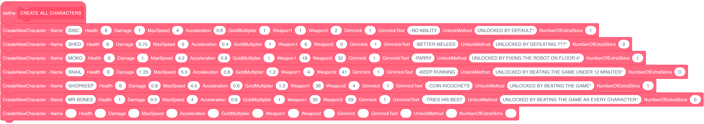

---

---

# Overview

## What is a character?
In Rabbit Hole, each character is defined by the PLAYER_name variable. \
Whenever the game checks for info related to the player you are playing as, it'll specifically look for this variable:

As a standard, each name written in capital letters.

## Where is character data stored?

All characters and their respective stats are stored in the **CharaSelect//CharaEngine** Object. \
This object takes care of loading the player character in the character selection screen. However, it is also where character is stored:

:::warning

Be very careful when modifying code in this object. \
You should pretty much never touch the code in this object except for the CREATE ALL CHARACTERS block shown above.

:::

## Player stats

Now this may look like a handful, but don't worry. I'll go over what each parameter does.

### Name

This is the character's name. **It should always be written in capital letters** due to how text is rendered. \
Whatever you write here will be set to the Player_name variable, which is how the game defines each character.

### Health

This is the max health a character starts with.

:::note

Mr Bones' max health is locked at 1 due to his **gimmick**, we'll get into what those are later.

:::

### Damage

This is the base damage **multiplier** for the character. \
This affects both guns and melee attacks.

:::tip

If a weapon does **10 damage** by default and the player has a **damage stat of 1.5**, then each shot will deal **15 damage** in total before any buffs.

:::

### MaxSpeed

This is top x velocity the player can reach. \
If the player's velocity goes above that value & touches the floor or stops holding the direction they are moving in, their velocity will decrease until they reach the max speed value again.

:::warning

Due to my poor coding abilities, collisions have a lot of trouble functionning properly around a max speed of 5.

:::

### Acceleration

This is how fast the player gains speed. This also affects traction.

### Gold Multiplier

:::note

I'll explain gold generation later on. 

:::
For now, all you need to know is that this stat affects **how likely** you are to gain coins. \
This stat **does not increase the amount of coins** an enemy can drop.

### Weapon1 & Weapon2

These are ids your starter weapons. By default, they both have a -0.25% modifier on them. \
Setting the weapon id to 0 disables it.
:::tip

To find the id of a weapon, look for the weapon list and check it's contents. \
\
 \
\
I'll explain what the values of each items are later but for now, just look for the name at the end of each item. The row of that name is the id you are looking for.

:::

### Gimmick
This is the character's unique properties. Gimmicks that are coded specifically for them, like Shed's dash, Shopkeep's coin or Snail's bash. \
It's value should be unique for each character (Unless the character has no gimmick, then set it to 0).

:::note

I'll explain gimmicks in detail during character creation later on. It's a lot more complex than other stats.
:::

### GimmickText
This is a short sentence explaining how the character's gimmick functions. You can write anything here. \
However, all text should be written in capital letters and each text should start with **-**.

### UnlockMethod

This is a short sentence explaining how to unlock the character, it shows up whenever you hover of the character when they are locked. You can write anything here. \
However, all text should be written in capital letters and each text has to end with **\***.

### NumberOfExtraSkins

This is the number of alternate skins available to this character. If the character has no alternate skins, the value of this parameter should be 0.